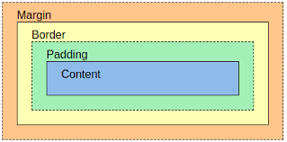
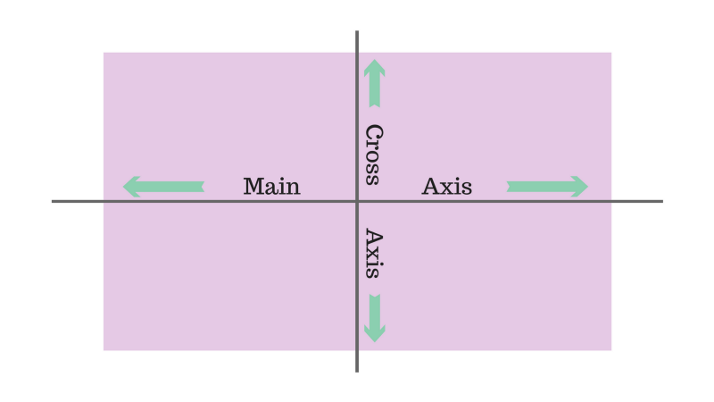
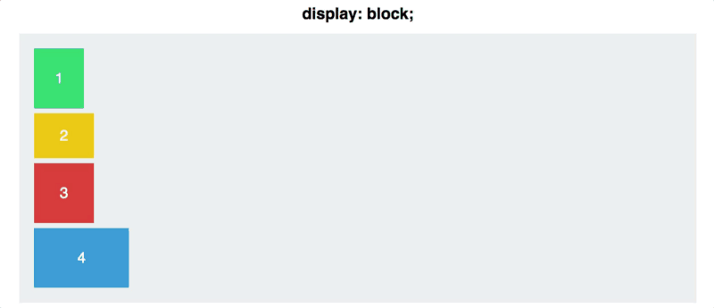
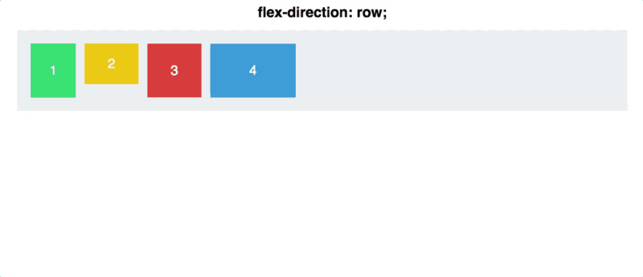
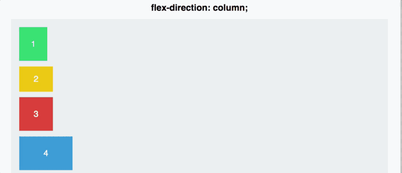
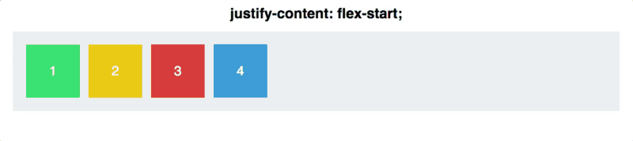
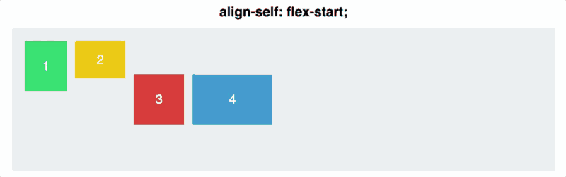
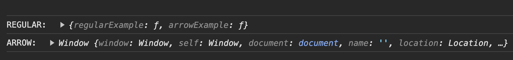
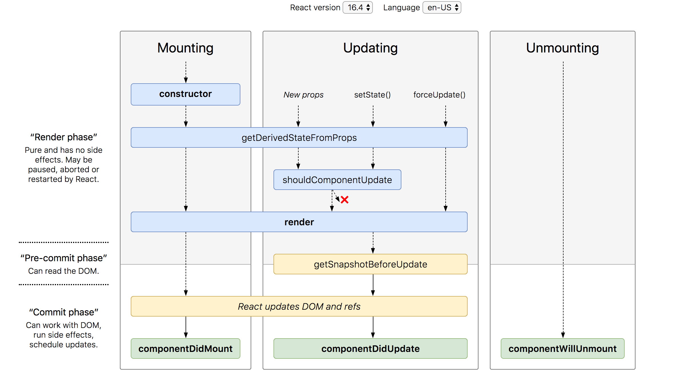
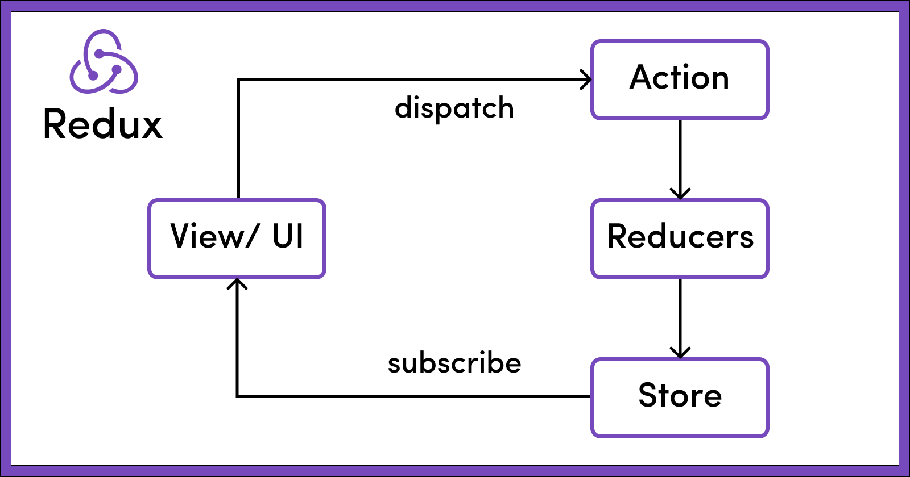

# my-interview-prep

### ***HTML***
• What is the purpose of the doctype declaration?

The DOCTYPE declaration is an instruction to the web browser about what version of HTML the page is written in. This ensures that the web page is parsed the same way by different web browsers.

• Explain the difference between `<div>` and `<span>`.

`<div></div>` element is for organising content in a block level structure. It takes full width of the screen or the width of the parent. It always start in a new line.
`<span></span>` element is for organising content in a inile level. It wrap around a part of the text, links or an image.

### ***CSS***
• What is the box model in CSS?

For very element, a box is wrapped around them. It has four parts; content, padding, border, margin.
Content: Is the area where text & images are incuded.<br />
padding: A space around content. It is transparent.<br />
Border: A border is surrounded to the padding & content.<br />
Margin: A space aruond the border. It is transparent.<br />
If we set a width & height to the element. The actual width and height of the element is calculated by adding the space taken for padding and border.<br />
So, totalWidth = width + leftPadding + rightPadding + leftBorder + rightBorder.<br />
totalHeight =  height + topPadding + bottomPadding + topBorder + bottomBorder.<br />
The box width &  height stops at the border.<br />



• Describe the difference between margin and padding.

Margin is space around the border. It is usefull wen you want to make a space between elements or position an element. Margin allow auto setting and negative values. Also, it can be used for overlapping on another element by setting negative values. It will not impacted by styling of other elements.<br />
Padding is the space between the border and the content. It is usefull to expand the space of the content with the border. For eg; add space between text and the border of a button. There is no auto settin and negative values in padding. It can be impacted by styling of other elements.

### ***CSS Flexbox***

• What is the flexbox model, and how does it work?


It allow us to arrange the divs. The parent should have a display:flex property to consider it as a flexbox model. display:block align the child divs in each line by taing enitre width of the container. But display:flex by default align the child div inline.


We can set the direction by using flex-direction:row/column property. Bydefault it will be row. Another option to change the order div and the postion by setting flex-direction:row-reverse/column-reverse. All these works on the main axis or x-axis. Even for column. It just make the x-axis to verticaly align.




To align items in the main axis, can use jstify-content:flex-start/flex-end/centre/space-between/space-around.
The space-between equaly add space between the child divs and fill the container. The space-around add equal space between child also add calculate half of the space between the two child divs and add it to before first child div and after last child div. So there will be a gap between the container and the first and last child divs.



To align items in cross-axis, use align-items:flex-start/flex-end/centre/stretch/baseline. Stretch will tae up the entire cross axis for the child div. Baseline, moves childs to up of the cross-axis.
To manipulate one of the child divs, use align-self:flex-start/flex-end/centre/stretch/baseline. It affects only to that partiular div not every child div.




• Explain the purpose of justify-content and align-items in flexbox.<br />

To align items in the main axis, can use jstify-content:flex-start/flex-end/centre/space-between/space-around.
The space-between equaly add space between the child divs and fill the container. The space-around add equal space between child also add calculate half of the space between the two child divs and add it to before first child div and after last child div. So there will be a gap between the container and the first and last child divs.


To align items in cross-axis, use align-items:flex-start/flex-end/centre/stretch/baseline. Stretch will take up the entire cross axis for the child div. Baseline, moves childs to up of the cross-axis.
To manipulate one of the child divs, use align-self:flex-start/flex-end/centre/stretch/baseline. It affects only to that partiular div not every child div.


### ***CSS Grid***

• How does CSS Grid differ from Flexbox?

Flexbox is 1D. So it can be arranged either in row direction or column direction. It is useful for creating simple layouts with single row or single column.
Grid is 2D. It can control both row and column arrangement simultaneusly. It is usefull to create more complex layout.

• Explain the use of the grid-template-columns property.<br />
To set the width of each column in grid. It can be set using grid-template-column:w1 w2 w3 or grid-template-column:repeat(no.Column, width).
https://www.freecodecamp.org/news/css-grid-tutorial-with-cheatsheet/#the-justify-items-property

### ***Responsive Design***
• What is the importance of media queries in responsive design?

Using media queries, a website can be optimised by changing the layout & content for various screen size. Also, it can improve the performance by loading only neccessary features and styles. It makes the website more faster. Responsiveness helps to avoid horizontal scrolling, distorted images.  It makes the application more user friendly and flexible to different screen size.

• Describe the difference between em and rem units in CSS.

Both are units of measurement of font size. `em` font size is relative to its parent's font size. Eg; If the parent font size is 16px then 1em of the child is equal to 16px. 0.5em of the child is equal to 8px(half of the parent's font size)
The `rem` font size is relative to the base font-size or root font. By default the root font or document font size is 16px, so in this case if any text with 1rem is equal to 16px.<br />
.parent {
  font-size: 16px;
}

.child-em {
  font-size: 1em; /* equal to 16px, relative to parent font size */
}

.child-rem {
  font-size: 1rem; /* equal to 16px, relative to base font size */
}

### ***JavaScript Basics***
• Explain the concept of hoisting in JavaScript.

Hoisting is a phenomena in which variables and functions can be accessed before its initialisation.

[](https://www.youtube.com/watch?v=Fnlnw8uY6jo)

Eg:
```
getName();
console.log(x)
var x=10;
function getName(){
  console.log('Anu Thomas');
}

o/p
----
Anu Thomas
undefined
```
• What is the difference between let, const, and var?

Both let and const variables are hoisted. Hoisted means, if we try to access those variables before its initialisation it will throw</br> reference error: variable __ cannot be accessed before its initialisation.</br> It is due to we are trying to access it when they are in temporal deadzone.<i>Temporal dead zone start from variable declaration to initialisation.</i> Both the variable can not be redeclared in the same scope. It will throw</br> 
reference error: variable __ being already declared.</br> Both are block scoped so can not access those variables outside the block. Let variable can be declare first and later initialise with a value.</br>
const variable must initialised with a value otherwise throw</br> syntax error: missing initializer in const declaration. The value of a const can't be changed through reassignment using the assignment operator, but if a constant is an object, its properties can be added, updated, or removed.</br>
Var variable can be redeclared in the same scope. It is functional scoped, so can not accessible outside function. Can declare first and later initialise with a value. It is not hoisted, so accessing before initilisation will return undefined not any errors.

Eg:
```
var x;
console.log(x);
x=10;
console.log(x)
function sample(){
  var x = 1000;
  let a ;
  a =100;
  const b = 'Hello'
  console.log(a,b)
  const c;
  c='test'
  console.log(c)
}
sample()
console.log(x)


o/p:
----
undefined
10
100 Hello
syntx error:missing initialiser in const declaration
10
```
### ****JavaScript Functions:**** 

• What is a closure in JavaScript?

A function along with its lexical scope or a function binds together with its lexical enviornment.

[](https://www.youtube.com/watch?v=qikxEIxsXco)

Eg:
```
function parent(){
  let a = 123;
  funtion child(){
    console.log(a)
  }
  return child;
}

let out = parent();
out();

o/p:
----
123 //here, child fn is in closure. Out is able to print 123 since child is stored along with its parent()
lexical enviornment
```
Eg2:
```
function sample(){
  let a = 'hello'
  setTimeout(() => {
    console.log(a)
  },3000)
}
o/p:
----
hello //printed after 3ms
```

• Explain the differences between arrow functions and regular functions.

In case of regular function, we can call the function before its defenition. Its because JS allocate the memory space for that function along with its function defenition.
In case of arrow function, it should be called after function defenition to work. If it is called it will
return undefined as result because js is treating this function as a variable. So while calling the function before the declaration, memory space is allocated but value or defenition is not available. So the value is initialised with undefined during memory allocation time.</br>
In regular function it has its on this context. But for arrow function, it has this value from its surrounding or lexical context in which arrow function is created.
```
Eg:
const myObj = {
  regular: function (){
    console.log('REGULAR:',this)
  },
  arrow: () => {
    console.log('ARROW:',this)
  }
}
myObj.regular();
myObj.arrow();
```
o/p
----
</br>

In regular function constructor can be created and use value of this. But it is not possible in arrow function as its this value is defined based on its lexical enviornment.
```
function regularfn(name,age){
    this.name = name;
    this.age = age;
    console.log(this)
}
new regularfn('Rinta',27);

const arrowfn = (name,age) => {
    this.name = name;
    this.age = age;
    console.log(this)
}
new arrowfn('Nithin', 29)

o/p
----
regularfn {name: 'Rinta', age: 27}
Uncaught TypeError: arrowfn is not a constructor
```

• What is function currying?

A function currying will convert a function with multiple arguments into seperate functions with single argument. So curryied function will take only one param at a time but return another function with one arg. It is constructed by chaining closures by immediately returning inner functions simultaneously.

```
const add = (a) => {
  return function (b) {
    if (b) return add(a + b);
    return a;
  };
};
console.log(add(1)(2)(4)());

o/p
---
7
```

### ****DOM Manipulation:****
• How does event delegation work in the DOM?

Event delegation happens in bubbling up phase. So in this, an event listener is attached to the parent element. If the event occure in child it is bubbled up to the parent, grand parent and so on till it reaches the root document.
Adv. of event delegation is that 1)performance improvement:only a single event listener is needed for every child. It will save memory by not attaching individual event listeners to every child element. 2) Support dynamic elements: can add or remove more child elements, by default the event for those child is registered with the parent. 3)Less code: handling a single event listener reduces the code length.

[](https://www.youtube.com/watch?v=3KJI1WZGDrg)

• Explain the purpose of the data- attributes.

It is for storing custom data in semantic html elements. It follows a syntax data-*. The data can be accessed inside js using dataset property. Also, can be used in css.
Eg;
```
<article
id="content"
name="content"
data-info="business"
data-index-number=3
>.....</article>

<script>
  const article = document.querySelector("#content")
  article.dataset.dataInfo //business
</script>

<style>
  article[data-index=3]{
    color:red;
  }
</style>
```
### ***AJAX***
• What is AJAX, and how does it work?

AJAX, asynchronous javascript xml: It allow a website update its content without reloading the entire page.</br>
Flow:</br>
browser create a js call -> this call create a XMLHttpRequest object -> sends a request to web server to update data -> the web server process the request -> sends back a response to browser -> the browser uses js to process the response -> directly update the data from the response to html page without reloading
Eg; Google search engine; suggest keyword while typing the search keywords without reloading the page
Eg2; Chat option on website to the customer service. We can continue chating while exploring the site without reloading the page

• Explain the role of the XMLHttpRequest object.

browser create a js call -> this call create a XMLHttpRequest object -> sends a request to web server to update data -> the web server process the request -> sends back a response to browser -> the browser uses js to process the response -> directly update the data from the response to html page without reloading
Eg; Google search engine; suggest keyword while typing the search keywords without reloading the page
Eg2; Chat option on website to the customer service. We cancontinue chating while exploring the site without reloading the page

### ***RESTful API Concepts***
• What is REST, and how does it differ from SOAP?

SOAP:Simple object access protocole. It follws a protocole or certain rules to get data. It is complex.
REST:Representational state transfer. It follows an architectural style. Easier.
SOAP protocole can be used in rest but not vice versa.


• Describe the common HTTP methods used in RESTful APIs.

Get: retrieve/read data from server</br>
Post: send data to the server to add another entry</br>
Put: update an existing data in the server</br>
patch: update only part of an existing data on the server</br>
Delete: delete the data from server</br>
Head: Read data, but only return header not the body of the response</br>
Options: Read info about the available communication options of the resource</br>

### ***React Basics***
• What is JSX in React?

JSX is a syntax to write html like syntax in js. It is transpiled or converted before it reaches the JSE. It is done by babel pkg.

• Explain the purpose of state in React components.

State in react is a local variable to maintane the state in component. useState() hook is for creating state variable. It re-render the component whenever the state gets updated. If we use normal local variable instead of state this component re-rendering will not happen when it is getting updated.

### ***React Components***
• Differentiate between functional and class components in React.

Functional components are javascript functions. It is also called stateless component as it doesn't have their state and lifecycle methods. It is more efficient and easy to code. It uses react's useState() hook to maintane the state and useEffect() hook to handle life cycle methods. It accepts props as input and return jsx as output.
```
import React, { useState } from 'react';

function Example() {
  const [count, setCount] = useState(0);

  function handleClick() {
    setCount(prevCount => prevCount + 1);
  }

  return (
    <div>
      <p>You clicked {count} times</p>
      <button onClick={handleClick}>
        Click me
      </button>
    </div>
  );
}
```
Class components are complex. It is also called as statefull component as it has their own state and lifecycle methods. It has `this` and constructor() to use state. It extends React.component class and has a render() method. The render() method returns jsx. It is less effiecient and more complex to write.
```
import React, { Component } from 'react';

class Example extends Component {
  constructor(props) {
    super(props);
    this.state = {
      count: 0
    };
    this.handleClick = this.handleClick.bind(this);
  }

  handleClick() {
    this.setState(prevState => ({ count: prevState.count + 1 }));
  }

  render() {
    return (
      <div>
        <p>You clicked {this.state.count} times</p>
        <button onClick={this.handleClick}>
          Click me
        </button>
      </div>
    );
  }
}
```

• Describe the lifecycle methods in a React class component.
There are three phases for component life cycle methods
- Mounting
- Updating
- Unmounting


React has two stages for each phase:render phase, commit phase.
- Mounting:
  - It occure when component is first created and inserted to the DOM
  - It has 4 methods:constructor(), getDerivedStateFromProps(), render(), componentDidMount()
      * Constructor(): It is for initializing the state and bind its methods to component's instance. Inside    constructor super(props) must be done, otherwise the props will be undefined.
      * getDerivedStateFromProps(): It is being called after constructor() before render(). It is for updating the current state based on the changes in props. It should retrun an object to update the state or null.
      * render(): It is for generating the virtual DOM of the component with the current state and props. It is   being called each time the state or props changed, or the parents component got re-rendered. It retrun JSX.    
      * componentDidMount():It will occure after mounting stage. So that it can fill the data and re-render the component. It is used for making API calls.
- Updating:
 - It is being done when component is re-rendered.
 - It has 4 methods: getDerivedStateFromProps(), shouldComponentUpdate(),  render(), componentDidUpdate(prevProps, prevState)
    * getDerivedStateFromProps(): It is called after constructor() but before render(). It is used for updating the state based on changes in props. It should return an object to update the state or null.
    * shouldComponentUpdate(nextProps, nextState): It is not called on initial render. It is for performance optimization. This method will make sure components behaviour will not get affected by current change in state or props. It returns true by default. It is called before render().
    * render(): It is for creating virtual DOM of the component with current state and props.  It is being called each time when component's state or props changes. It returns JSX.
    * componentDidUpdate(prevProps, prevState):It is called after update but not after initial render. This also can be used for making API calls based on newly updated props.
- Unmounting: 
  - This method is being called when DOM needs to be removed
  - It has 1 method:componentWillUnmount()
    * componentWillUnmount(): called just before the component is removed and being destroyed. It is usefull for cleaning like removing any subscription, network calls or canceling any timers

### ***React Hooks***
• Explain the use of the useState hook in React.

It is for keeping local variables of a component. It takes initial value for state and return the current state and state setter function to update the state. It works with array, obj, strings etc.

• What is the useEffect hook, and why is it used?

It is for doing life cycle methods in functional component. It accepts two args. One is a callback fn, second optional dependancy array. If dependency array is not there, the callback fn will called on each render. If an empty array passed as second argument then the callback fn will called only once(componentDidMount). If the dependency array has any state variable then the callback fn will get executed each time when the state gets updated(componentDidUpdate). To do compenentWillUnmount in functional component, return from callback fn of useEffect hook.

• How do you update a single property in an object using setState? Consider state,</br>
```
const [employee, setEmployee] = useState({
    name: "Stella",
    age: 26,
    position: "engineer",
  });
```
```
o/p
---
const copy = JSON.parse(JSON.stringify(employee))
copy.age = 30;
setEmployee(copy)

or

setEmployee({...employee, age:30})
```

### ***Redux***
• What problem does Redux solve in a React application?

Redux is for managing the state. There will be a store where the state is maintained and all the components who subscribed to the store has access to it. It is more convinient and improve the performance. When it comes to larger application, managing the state and updating the state by passing through all the component tree is very difficult and confusing. Redux solves this problem. When the state gets updated by default all the component who are subscribed to the store get notified. Using redux developer tools can see the history of the state and current value. It is easy to debug also. 

• Explain the roles of actions, reducers, and the store in Redux.



Store is the place where all the data of the application is stored. It is a global store so components who have subscription to the store can access it. An action will tell the reducer what type of action to be done and the information or the data. The reducer will be the one doing that type of action and returning a new instance of the state.

### ***Web Performance Optimization:***
• How can you optimize website performance?

<b>Resource optimization</b>: By reducing size of resources such as images and js files by compressing them and using appropriate image format like JPEG2000, JPEG XR, and WebP.</br>
<b>Code splitting</b>: use code splitting to load only necessary resources for a specific page. This will reduce the load time as well the data usage.
<b>Minimize the number of HTTP requests</b>: It can be done by combining multiple files into one and using browser caching.
<b>Progressive loading</b>: Use progressive loading techniques such as lazy loading to load only necessary resources for the user.

• Explain lazy loading and its benefits.

Lazy loading will show only the data on demand. So we can progressively show the data. Lets say I have A and B resources and each will tacke 1MB to load. The user request only either of these or lets say user request A rarely or B rarely. If we show both at one time the total loading time will take 2MB. But if we use lazy loading technique to load the resourse based on demand, we can reduce the 1MB loading time for the web app.

### ***Cross-Origin Resource Sharing (CORS):***
• What is CORS, and how does it work?

CORS is an HTTP feature to enable web apps running in one domain to access resources in another domain. To avoid cross-site scripting attacks, modern browsers use same origin policy.</br>
In standard internet communication, your browser sends an HTTP request to the application server, receives data as an HTTP response, and displays it. In browser terminology, the current browser URL is called the current origin and the third-party URL is cross-origin.
When you make a cross-origin request, this is the request-response process:
- The browser adds an origin header to the request with information about the current origin's protocol, host, and port
- The server checks the current origin header and responds with the requested data and an Access-Control-Allow-Origin header
- The browser sees the access control request headers and shares the returned data with the client application
Alternatively, if the server doesn’t want to allow cross-origin access, it responds with an error message.</br>

• Describe how to handle CORS issues in a web application.

By setting the Access-Control-Allow-Origin header to “*” to allow any domain to access the resource.

### ***Web Security:***
• What is Cross-Site Scripting (XSS), and how can it be prevented?
• Explain Cross-Site Request Forgery (CSRF) and its prevention methods.

### ***Version Control (Git):***
• Describe the purpose of Git and how it differs from other version control systems.
• Explain the Git branching strategy and the use of merge vs. rebase.

### ***Build Tools (e.g., Webpack):***
• What is Webpack, and how does it improve the frontend development workflow?
• Explain the concept of code splitting in Webpack.

### ***Testing in Frontend Development:***
• What are the benefits of unit testing in a frontend application?
• Describe the differences between unit testing and integration testing.
• How unit testing is done?